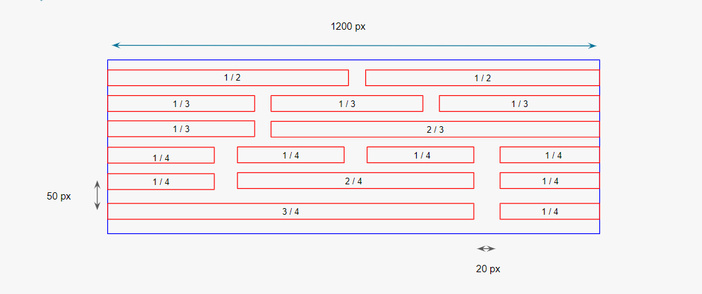

# Grid With Float

> This is the one of Second meeting CSS & HTML challenges -> Grid with display:float (you can see a preview in the bottom of the page).

---

### Table of Contents

- [Challenge Languages](#Languages)
- [Instructions](#Instructions)
- [Preview](#Preview-And-Style-Guild)

---

## Languages

* HTML
* CSS

---

## Instructions

- [ ] Clone this repository.
- [ ] Checkout to the starting-files branch
- [ ] Create a grid using the display:float property.

---

## Preview And Style Guild

**GOOD LUCK!**🚀

